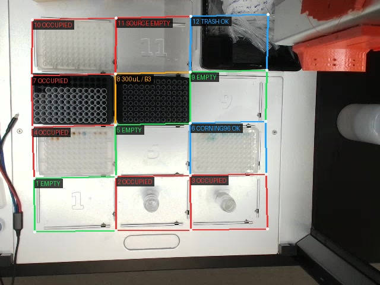

# Opentrons Vision Validation

## Goal

This is the **Opentrons OT-2 adapter** for the environment-neutral `puda-machine-vision-validation` skill. Load the generic gate first, then use this adapter for OT-2-specific deck slots, labware definitions, pipette mounts, trash, and A1–H12 tip/well checks. Camera calibration, slot polygons, endpoints, and current-scene evidence must remain scoped to the active environment (BEARS, IMRE, NTU, or another site).

Prevent Opentrons OT-2 runs from starting with the wrong physical deck setup. Before a physical Opentrons run in the active PUDA environment, capture a fresh image from that environment's configured camera, verify the slots used by the protocol, identify visible labware/items, and stop for user confirmation when anything is uncertain or mismatched.

This is a **physical safety gate**. PUDA protocol validation checks command structure; it does not prove the robot deck contains the expected labware.

## When to Use

Use this skill before running any Opentrons protocol that depends on deck setup, including:

- liquid transfer, mixing, aspiration, dispense, or plate workflows
- protocols with tipracks, source plates, destination plates, reservoirs, vials, or modules
- colour-mixing or viscosity workflows that generate/run OT-2 protocols
- any user request that names deck slots or labware placement

Do not use it as a substitute for Opentrons protocol validation. Use both: validate protocol structure first, then visually validate physical setup before robot execution.

## Critical Rule

Before any physical Opentrons run, perform a **vision validation gate**:

1. Extract the expected deck map from the user request and protocol.
2. Capture a fresh image of the OT-2 deck.
3. Inspect every slot used by the protocol.
4. Identify occupied slots and visible labware/items.
5. Compare expected vs observed deck setup.
6. Ask the user to confirm uncertain labware or any mismatch.
7. Do **not** execute robot motion until the visual check passes or the user explicitly approves proceeding despite the risk.

If exact labware identity is unclear from the image, **ask the user**. Do not guess exact Opentrons labware definitions from appearance alone.

## OT-2 Deck Slot Layout

Use the standard OT-2 deck layout:

| Row | Slots |
|---|---|
| Back | 10, 11, 12 |
| Middle | 7, 8, 9 |
| Front/middle | 4, 5, 6 |
| Front | 1, 2, 3 |

Vertical relationships:

- Slot **10** is above slot **7**.
- Slot **11** is above slot **8**.
- Slot **12** is above slot **9**.

If a slot is outside the camera view or obscured, mark it `not visible` or `obscured`. Do not infer occupancy from neighbouring slots.

## Labware Coordinates and Individual Tip Validation

Use the **exact loaded labware definition** as the source of truth for valid well/tip names. Do not assume every plate or rack has the same coordinate set.

For standard 96-position Corning plates and Opentrons 96-tip racks:

- rows are **A–H** (eight rows), not A–G
- columns are **1–12**
- valid positions therefore run from `A1` through `H12`
- `B2` means row **B**, column **2**

If the user gives an A–G range for standard 96-position labware, flag the omitted row H. If the labware is custom and genuinely has only rows A–G, verify that against its custom definition instead of applying the standard 96-position convention.

When a request names a position such as `B2`:

1. Normalize the position to uppercase row plus integer column.
2. Verify that the position exists in the exact labware definition used by the protocol.
3. Verify the labware's physical orientation from visible `A1`/row/column markings or another authoritative orientation cue. Never infer image-left/image-right coordinate orientation from a generic deck view.
4. Crop the requested labware from the **fresh image** using its four visible outer corners.
5. If perspective correction is needed, rectify that quadrilateral to a clean top-down view with a homography. Use coordinate geometry internally, but **do not draw a row/column grid over the tip or well image**.
6. Validate the requested position from the clean crop by counting from the established A1 orientation and comparing it with its immediate neighbours. Preserve and present an unannotated crop as evidence.
7. If a visual callout is useful, add only a small circle or arrow at the requested position and also keep the clean crop; do not overlay cell boundaries or a full coordinate lattice.
8. If an edge row/column is clipped, the A1 orientation is uncertain, or the requested position is obscured, report `not visible` or `needs confirmation` rather than adding a grid to force a mapping.
9. For tip pickup, inspect the requested position itself—not merely whether a tiprack occupies the slot—and report one of:
   - `tip present` — the requested position is visible and a tip is clearly seated there
   - `tip absent` — the requested position is visible and clearly empty
   - `needs confirmation` — rack and position are identified, but image detail cannot prove tip presence
   - `not visible` — orientation, occlusion, or framing prevents checking the position
10. Treat `tip absent`, invalid coordinates, uncertain rack orientation, and `not visible` as a failed execution gate. Treat `needs confirmation` as blocked pending user confirmation or a clearer fresh image.

A full or partially filled rack must not be reported as having a tip at `B2` unless `B2` itself is resolved and visibly checked. If the camera resolution cannot distinguish an individual tip from an empty collar, say so rather than guessing.

Completion criterion: every requested well/tip coordinate is valid for the exact definition, its physical orientation is established, and any requested pickup position has an explicit tip-presence status.

## Example Annotated Deck Image

Use this image as the preferred presentation example for a full-deck occupancy check:



Asset path: `assets/OT2-deck-slot-validation-example.jpg`

Presentation conventions shown in the example:

- First calibrate a **shared 4 × 5 deck lattice** from the visible physical slot outlines: four vertical boundary lines and five horizontal boundary lines. Use their intersections as shared corner nodes.
- Derive each slot polygon from four neighbouring lattice nodes. Do not estimate 12 polygons independently; adjacent slots must reuse the exact same edge and corner coordinates.
- Use either a deck homography or piecewise perspective quadrilaterals when the camera is tilted, but anchor them to the physical slot perimeter—not to the visible labware footprint.
- Cover the **entire physical slot space** from one shared boundary to the next. For back-row slots 10–12, include the true top deck boundary; do not start the polygon at the top edge of a plate, rack, label, or trash item.
- Follow the physical layout exactly: front `1–3`, then `4–6`, `7–9`, and back `10–12`.
- Adjacent polygons must meet at their real shared boundary with no gap and no overlap. In particular, slot 10 must share its complete lower edge with slot 7, and slot 11 with slot 8.
- Confirm both **coverage and isolation**: every polygon contains the complete physical slot, while containing no area from a neighbouring slot.
- For a 96-position rack/plate crop, ensure rows **A–H** are included; a crop beginning at row B is invalid for coordinate validation.
- Put the slot number and status in a high-contrast label near the polygon's top-left corner without obscuring wells/tips.
- Use **green** for `EMPTY`, **red** for `OCCUPIED`, and **orange** for `OBSTRUCTED`.
- Include an on-image legend using the same colours.
- Keep the underlying labware visible with transparent or outline-only polygons.
- Use `OBSTRUCTED`, rather than `EMPTY`, when cables or other objects prevent a confident check.
- Run a second visual verification on the annotated image. Reject and redraw the overlay if any boundary crosses adjacent labware or clips any row/column needed for validation.

When returning the result to the user, attach the annotated image and include concise occupied, empty, obstructed, and not-visible slot lists.

## Vision Validation Workflow

### 1. Extract the Expected Deck Map

List every slot used by the planned Opentrons run:

| Slot | Expected labware/item | Role |
|---|---|---|
| 8 | 300 µL tiprack | tips |
| 3 | mixing plate | destination |

Completion criterion: every slot the protocol will use has an expected item, every requested source/destination well and tip position is listed, and any required-empty slots are explicitly listed.

### 2. Capture a Fresh Deck Image

Prefer the `opentrons` machine `capture_image` command when available:

```bash
puda machine commands opentrons
# create/run a one-command protocol:
# name: capture_image
# machine_id: opentrons
# params.filename: opentrons-vision-<UTC timestamp>.jpg
```

If PUDA capture fails with `No camera configured. Pass camera_index when constructing Opentrons.`, use the configured BEARS RTSP fallback without restarting edge services:

```bash
mkdir -p /home/opentron/temp_opentrons/captures /tmp/puda-latest-images
ffmpeg -y -rtsp_transport tcp -i rtsp://100.102.45.58:8554/cam0 \
  -frames:v 1 -q:v 2 /home/opentron/temp_opentrons/captures/<filename>.jpg
cp /home/opentron/temp_opentrons/captures/<filename>.jpg /tmp/puda-latest-images/<unique-copy>.jpg
stat -c '%n %s bytes %y' /tmp/puda-latest-images/<unique-copy>.jpg
sha256sum /tmp/puda-latest-images/<unique-copy>.jpg
```

Completion criterion: a new image file exists, has non-zero size, and its path/hash are recorded.

### 3. Inspect and Identify the Image Conservatively

Before assigning an exact labware identity, consult the live [Opentrons Labware Library](https://labware.opentrons.com/) and follow [the visual-identification reference](references/opentrons-labware-library-visual-identification.md). Compare the slot crop with official candidates from the correct category, report the official display name and API load name when supported, and distinguish OT-2 labware from Flex labware. Do not rely on colour alone.

For each expected slot, report:

- whether the slot is visible
- whether the slot is occupied
- visible labware/item description
- confidence: high, medium, or low

Also report any unexpected occupied or obstructed slot that could affect the run.

Use conservative language:

- `appears to be a 300 µL tiprack` is acceptable when visually likely but not certain.
- `black multi-well rack/plate; please confirm exact labware` is better than guessing.
- `not visible` or `obscured` is better than assuming.

Completion criterion: there is a slot-by-slot observation table for all expected slots plus any unexpected occupied/obstructed slots.

### 4. Compare Expected vs Observed

Use this status table:

| Slot | Expected | Observed | Status |
|---|---|---|---|
| 8 | 300 µL tiprack | appears to be 300 µL tiprack | OK / needs confirmation |
| 3 | mixing plate | glass vial | MISMATCH |

Status values:

- `OK` — expected slot is occupied by the expected labware/item with high confidence.
- `needs confirmation` — slot is occupied but exact labware identity is uncertain.
- `MISMATCH` — observed item differs from expected, expected slot is empty, or unexpected item blocks a required empty slot.
- `not visible` — camera cannot verify.

Completion criterion: every protocol slot has one status.

### 5. Gate Execution

- If every required slot is `OK`, continue with the normal PUDA Opentrons run workflow.
- If any slot is `needs confirmation`, ask the user to confirm before running.
- If any slot is `MISMATCH` or `not visible`, do not run. Ask the user whether to correct/reposition the deck or explicitly approve proceeding despite the risk.
- If the user corrects labware identity or slot occupancy, update the current run's deck map and re-check the protocol against it.
- If the correction changes the required setup, patch or regenerate the protocol and re-validate before running.

Completion criterion: the user's approval/correction is recorded before any physical robot execution.

## Example

User asks for a liquid transfer using Opentrons with:

- 300 µL tiprack on slot 8
- mixing plate on slot 3

Expected deck map:

| Slot | Expected item | Role |
|---|---|---|
| 8 | 300 µL tiprack | tips |
| 3 | mixing plate | source/destination |

Required pre-run check:

1. Capture a fresh deck image.
2. Inspect slot 8 and slot 3.
3. Report the comparison:

| Slot | Expected | Observed | Status |
|---|---|---|---|
| 8 | 300 µL tiprack | appears to be 300 µL tiprack | OK |
| 3 | mixing plate | glass vial | MISMATCH |

4. Stop and ask the user to confirm/correct slot 3 before executing the transfer.

## Known Setup Conventions

- On the user's BEARS OT-2 setup, **slot 12 contains the standard Opentrons trash bin**. Treat it as an expected fixed deck item, not as an unexpected obstruction. Report it as `Opentrons trash bin (expected)` unless the image shows a materially different object or the bin interferes with another required item.

## OT-2 Top-Camera Labware Example

The user explicitly confirmed the labware identities in the fresh BEARS OT-2 frame captured at `2026-07-22T00:29:13Z`. Preserve and use the unannotated image as an angle-specific visual comparison reference:

- Asset: `assets/OT2-top-camera-labware-example.jpg`
- SHA-256: `f39ff22b512c29408cbdc3b4b32b52d0219dad8673bd47dd2a2e3e11855e19a6`
- Slot 2: custom 20 mL glass vial
- Slot 3: custom 20 mL glass vial
- Slots 4, 6, and 10: Corning 96-well plate
- Slot 7: 1000 µL tiprack
- Slot 8: 300 µL tiprack
- Slot 12: standard Opentrons trash bin

For a later fresh image from the same fixed BEARS camera angle, compare visible object morphology against this reference: overall footprint, height/perspective profile, frame colour and geometry, well/tip opening size, opening spacing, and the distinctive vial silhouette. Use a reference identity only when the fresh object's visible structure matches with adequate confidence. Do not assume that a labware type remains in the same slot, and do not infer occupancy from this historical frame. If the camera angle, zoom, lighting, lids, occlusion, or object geometry prevents a reliable match, report `needs confirmation`.

These labels are user-confirmed labware categories. Do not invent an exact API load name for the custom vial or Corning plate unless the current protocol, label, or official definition establishes it. Where applicable, `opentrons_96_tiprack_1000ul` and `opentrons_96_tiprack_300ul` are candidate standard API names, but verify against the current protocol/definition before execution.

## Current-Run Evidence Policy

Each vision validation must be independent. Determine occupancy and placement from:

1. the **current user-provided expected deck map**,
2. a **fresh image captured for this validation**,
3. the labware-identification guidance and official Opentrons Labware Library references stored in this skill, and
4. user-confirmed angle-specific reference images stored in this skill, used only for visual morphology comparison.

Do **not** copy a slot assignment or occupancy state from an earlier validation into the current result. Deck contents may have changed between captures. A user-confirmed reference may support identity only when the object in the fresh image visibly matches it from the same camera angle. If the fresh image cannot distinguish 300 µL from 1000 µL tips or one plate definition from another—even after comparison—report `needs confirmation` rather than guessing.

The only standing setup convention is the standard Opentrons trash bin in slot 12; even this must still be visibly present in the fresh image.

## Common Pitfalls

- **Misclassifying the slot 12 trash bin.** On the user's BEARS OT-2 setup, the item in slot 12 is the expected Opentrons trash bin; do not label it `OBSTRUCTED` merely because it occupies the slot.
- **Guessing labware from appearance.** Ask the user when exact labware identity is uncertain.
- **Blindly carrying earlier occupancy into a fresh validation.** Never assume that a prior slot assignment or occupied/empty state still holds. Re-detect occupancy from the fresh image. User-confirmed angle-specific references stored in this skill may support labware identity only through a visible morphology match.
- **Discarding user-confirmed visual references.** Preserve explicit user-confirmed angle-specific reference images and labels in this skill. Use them for future same-angle comparison, while reporting `needs confirmation` whenever the fresh object does not match clearly.
- **Forgetting back-row slots.** Slot 10 is above 7, slot 11 above 8, and slot 12 above 9.
- **Mistaking artifacts for occupancy.** Transparent lids, reflections, cables, and neighbouring labware can look like slot occupation.
- **Running after a mismatch.** Stop until the user corrects the deck or explicitly approves proceeding.
- **Treating `puda protocol validate` as physical validation.** It is not; vision validation is separate.

## Verification Checklist

- [ ] Expected deck map extracted from the user request/protocol.
- [ ] Fresh deck image captured and verified with path/size/hash.
- [ ] Shared 4 × 5 deck-lattice intersections calibrated from physical slot outlines.
- [ ] Adjacent slot polygons reuse exact shared nodes/edges—no independently guessed boundaries.
- [ ] Every polygon covers its complete physical slot from boundary to boundary without entering a neighbour.
- [ ] Back-row polygons include the true top boundaries of slots 10–12.
- [ ] Every 96-position crop includes complete rows A–H and columns 1–12.
- [ ] Perspective correction, if used, produces a clean unannotated evidence crop.
- [ ] No row/column grid is rendered over the tip or well image.
- [ ] Requested position identified internally from established A1 orientation and checked against neighbours.
- [ ] Any optional callout is limited to a small circle/arrow, with the clean crop retained.
- [ ] Final annotated deck image independently rechecked for slot-boundary alignment.
- [ ] Exact labware candidates compared against the live Opentrons Labware Library when identification is required.
- [ ] Every requested well/tip coordinate validated against the exact labware definition.
- [ ] Physical A1/row/column orientation established before mapping an image coordinate.
- [ ] Every requested pickup position inspected for individual tip presence and assigned an explicit status.
- [ ] Occupancy and placement based on the current expected deck map and fresh image; any prior user-confirmed angle-specific reference is used only for visible morphology matching, never for assumed slot state.
- [ ] Official display name/API load name and confidence reported, or ambiguity explicitly marked.
- [ ] Every expected slot inspected.
- [ ] Unexpected occupied/obstructed slots reported.
- [ ] Expected-vs-observed table produced.
- [ ] User asked to confirm uncertain or mismatched labware.
- [ ] Robot execution only proceeds after visual validation passes or user explicitly approves.
