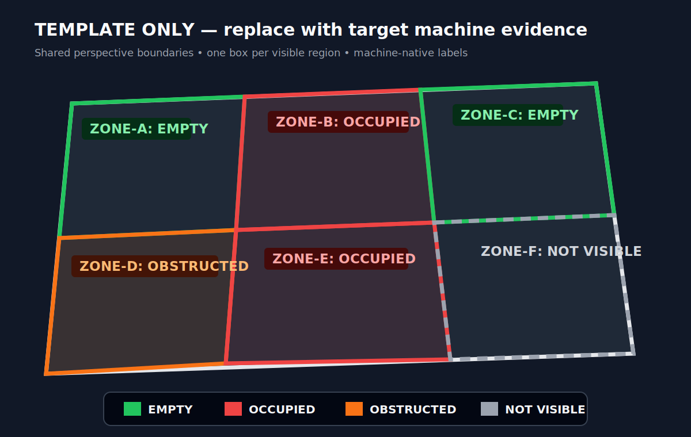

# PUDA Machine Vision Validation Template

> **Template skill:** copy this directory, rename the folder and frontmatter `name`, replace every `<PLACEHOLDER>`, and add machine-specific references before using the result as a physical execution gate. Do not use unresolved placeholders as safety evidence.

## Goal

Prevent `<MACHINE_NAME>` workflows in `<ENVIRONMENT>` from starting with the wrong visible physical setup. Before physical execution, capture a fresh image from the site-scoped camera, annotate every visible machine deck/workspace region, compare expected versus observed state, and stop when anything required is uncertain, mismatched, obstructed, or not visible.

This is a **physical safety gate**. It does not replace protocol/schema validation, telemetry, calibration, homing, interlocks, operator approval, or machine-native safety controls.

## When to Use

Use this skill before `<MACHINE_ID>` workflows that depend on visible physical conditions, including:

- `<MACHINE-SPECIFIC WORKFLOW TYPE>`
- placement or occupancy of `<SLOTS / ZONES / TRAYS / STAGES / PANS / CHANNELS>`
- required-empty or keep-out regions
- visible fixtures, tools, vessels, samples, cables, lids, clamps, or targets
- a user request for validation without execution

Do not use this template as an active gate until all placeholders are resolved and current machine/camera references are installed.

## Critical Rule

Before any physical `<MACHINE_NAME>` run:

1. Read the active environment with `puda env current`.
2. Select the exact environment-scoped machine profile.
3. Extract the expected workspace map from the current request and protocol.
4. Capture a fresh image from the configured site-scoped camera.
5. Inspect the clean image before annotation.
6. Draw the full machine/deck boundary and one labelled box around every visible workspace region.
7. Compare expected versus observed state.
8. Do not execute motion until all required visual checks pass or the user explicitly accepts each stated risk and separately authorizes execution.

If exact identity, orientation, occupancy, or clearance is uncertain, ask the user. Never infer current state from an earlier image.

## Machine and Camera Profile

Replace this table with the deployed profile or link to an environment-scoped reference under `references/`.

| Field | Required value |
|---|---|
| Environment | `<OUTPUT OF puda env current>` |
| Machine ID | `<EXACT PUDA MACHINE ID>` |
| Machine family | `<LIQUID HANDLER / ARM / CENTRIFUGE / BALANCE / OTHER>` |
| Image source | `<PASSIVE SNAPSHOT/STREAM OR APPROVED CAPTURE COMMAND>` |
| Camera ID and pose | `<FIXED CAMERA ID + POSE>` |
| Calibration | `<HOMOGRAPHY/CALIBRATION ID, VERSION, DATE, OR UNAVAILABLE>` |
| Workspace model | `<MACHINE-NATIVE REGION NAMES AND BOUNDARIES>` |
| Coordinate model | `<AUTHORITATIVE POSITION DEFINITION OR NOT APPLICABLE>` |
| Identity references | `<OFFICIAL DOCS/LIBRARY/USER-CONFIRMED SAME-ANGLE REFERENCE>` |
| Safety gate | `<WHICH STATES BLOCK EXECUTION>` |

Profile identity is `(environment, machine_id, camera_id, camera_pose)`. Never reuse endpoints, credentials, pixel coordinates, polygons, calibration, object identity, or occupancy from another profile.

## Machine Workspace Layout

Document the machine-native layout here. Do not copy the OT-2 12-slot layout unless this machine is actually an OT-2 and the Opentrons adapter is the correct skill.

| Physical row/zone | Regions |
|---|---|
| `<ROW OR ZONE>` | `<REGION IDs>` |
| `<ROW OR ZONE>` | `<REGION IDs>` |

State any authoritative adjacency and orientation relationships:

- `<REGION A>` is `<ABOVE / LEFT OF / ADJACENT TO>` `<REGION B>`.
- Workspace origin/orientation cue: `<VISIBLE MARKER OR AUTHORITATIVE DEFINITION>`.
- Fixed expected item/region: `<ITEM AND REGION OR NONE>`.

If a region is outside the frame or occluded, mark it `not visible` or `obstructed`; never infer it from neighbours.

## Addressable Positions

Use the exact machine, fixture, rack, plate, tray, or holder definition as the source of truth.

When the user names a position:

1. Normalize and validate it against the exact definition.
2. Establish physical orientation from a visible marker or authoritative cue.
3. Crop the complete parent object from the fresh image.
4. Perspective-rectify internally when needed.
5. Do **not** draw a full row/column grid over tips, wells, samples, or targets.
6. Inspect the requested position and immediate neighbours in a clean crop.
7. Optionally add one small circle or arrow while retaining the clean crop.
8. Report `present`, `absent`, `needs confirmation`, or `not visible`.

Completion criterion: each requested coordinate is valid, orientation is established, and the requested position has an explicit evidence-based state.

## Example Annotated Machine/Deck Image

Use the generic asset as a presentation-structure example only:

Asset path: `assets/machine-deck-region-annotation-example.svg`

Replace this synthetic asset with an annotated image from the target machine/camera profile before deployment. The replacement must not be treated as current-run evidence.

Presentation conventions:

- Draw the full visible machine/deck outer boundary.
- Build one shared lattice or boundary graph from physical boundary intersections.
- Draw one complete closed box around **every visible workspace region**, not only protocol-used regions.
- Adjacent boxes reuse exact shared nodes and edges.
- Use an axis-aligned rectangle only for an orthogonal view; use a perspective-aligned quadrilateral for a tilted view.
- Anchor boxes to machine/deck boundaries, never to the footprint of occupying objects.
- Label every region with its machine-native identifier and observed state.
- Use green `EMPTY`, red `OCCUPIED`, orange `OBSTRUCTED`, and grey `NOT VISIBLE`.
- Include an on-image legend and keep evidence visible with outline-only or transparent boxes.
- Independently reject/redraw overlays that clip, overlap, cross neighbours, omit regions, or obscure evidence.

For irregular regions, use the minimum-vertex polygon that follows the physical boundary rather than forcing an inaccurate rectangle.

## Vision Validation Workflow

### 1. Extract the expected workspace map

| Region | Expected object/state | Role | Required? |
|---|---|---|---|
| `<REGION>` | `<EXPECTED ITEM/STATE>` | `<ROLE>` | `<YES/NO>` |

Also list requested addressable positions, required-empty regions, keep-out zones, and non-visual prerequisites.

Completion criterion: every physical precondition has a named expected observation or is explicitly classified as non-visual.

### 2. Capture fresh evidence

Prefer a passive configured image source. If capture can move hardware or alter machine state, obtain separate approval before capture.

Record:

- UTC capture time and provenance
- clean image path, non-zero size, and SHA-256
- environment, machine ID, camera ID, and pose
- whether capture was passive
- transformations applied only to copies

Never expose camera credentials or secret-bearing URLs.

Completion criterion: a fresh, non-empty clean image exists with provenance and hash.

### 3. Inspect and identify conservatively

Classify the clean image before drawing overlays. For every expected region and every unexpected occupied/obstructed region, report visibility, occupancy/state, observed category or identity, confidence, and visual cue.

Use current official references from [`references/machine-workspace-visual-identification.md`](references/machine-workspace-visual-identification.md). User-confirmed same-angle images support morphology only; they never prove current occupancy.

Completion criterion: all expected and unexpected regions are classified without expectation-biased guessing.

### 4. Draw and verify all region boxes

Create an annotated copy with the outer boundary, one box per visible region, labels, state colours, and legend. Preserve the clean image separately.

Completion criterion: every visible workspace region has a complete, correctly aligned box; adjacent regions share exact edges; no region is missing or crossed.

### 5. Compare expected versus observed

| Region | Expected | Observed | Confidence | Status |
|---|---|---|---|---|
| `<REGION>` | `<EXPECTED>` | `<OBSERVED>` | `<HIGH/MEDIUM/LOW>` | `<OK/NEEDS CONFIRMATION/MISMATCH/NOT VISIBLE/OBSTRUCTED>` |

Status values:

- `OK`: expected state is visible and supported with adequate confidence.
- `needs confirmation`: visible, but exact identity or state is uncertain.
- `MISMATCH`: visible state conflicts with expected state.
- `not visible`: framing, pose, occlusion, or resolution prevents verification.
- `obstructed`: another item blocks inspection or a required-clear region.

Completion criterion: every required region has exactly one status.

### 6. Gate execution

- Continue only when every required visual condition is `OK` and all non-visual prerequisites pass.
- `needs confirmation`, `MISMATCH`, `not visible`, and `obstructed` keep the gate closed unless the user explicitly accepts the stated risk.
- A physical setup change requires a new image and independent validation.
- Vision approval does not itself authorize machine execution.

Completion criterion: the gate decision and any user correction/override are recorded before physical execution.

## Output Format

Report:

1. **Environment, machine, and evidence** — environment, machine ID, camera/pose, time, clean and annotated paths/hashes.
2. **Annotated machine/deck image** — outer boundary, one labelled box per visible region, state colours, and legend.
3. **Expected-vs-observed table** — region, expected, observed, confidence, status.
4. **Region summary** — occupied, empty, obstructed, not-visible, and unexpected regions.
5. **Coordinate checks** — requested positions without a grid overlay.
6. **Non-visual prerequisites** — protocol, telemetry, calibration, interlocks, and approval.
7. **Gate decision** — pass, blocked, or needs confirmation.
8. **Execution statement** — whether any command or motion occurred.

## Known Setup Conventions

Replace this section with user-confirmed, environment-scoped standing conventions. Keep them minimal and verify them in every fresh image.

- `<FIXED ITEM/REGION CONVENTION OR NONE>`

Do not place credentials, current occupancy, or cross-site camera coordinates here.

## Current-Run Evidence Policy

Every validation is independent. Use only:

1. the current request/protocol,
2. a fresh image captured for this validation,
3. current official machine/fixture references, and
4. same-profile historical images only for visible morphology comparison.

Never copy slot/region occupancy, orientation, alignment, or object identity from an earlier run. If morphology does not match clearly, report `needs confirmation`.

## Common Pitfalls

- Leaving `<PLACEHOLDER>` values in a deployed skill.
- Reusing another site’s camera endpoint, credentials, calibration, or region boxes.
- Applying OT-2 slot semantics to a non-OT-2 machine.
- Drawing boxes only around workflow-used regions.
- Drawing axis-aligned rectangles on a tilted view instead of perspective quadrilaterals.
- Following object footprints instead of physical machine/deck boundaries.
- Guessing object identity because it matches the expected setup.
- Reusing historical occupancy as current evidence.
- Drawing full coordinate grids over physical positions.
- Treating an image as proof of telemetry, calibration, tare, continuity, or interlocks.
- Executing after an unresolved mismatch without explicit risk acceptance and separate run authorization.

## Template Deployment Checklist

- [ ] Directory copied and renamed to the final lowercase skill name.
- [ ] Frontmatter `name` and `description` replaced for the deployed machine/user.
- [ ] No `<PLACEHOLDER>` tokens remain.
- [ ] Environment, machine ID, camera ID/pose, and profile sources are documented.
- [ ] Machine-native workspace layout and region names replace generic examples.
- [ ] Example asset replaced with a target-profile annotated image.
- [ ] Official identity references added under `references/`.
- [ ] No credentials or secret-bearing URLs are committed.
- [ ] Skill frontmatter, links, and file size validate.

## Per-Run Verification Checklist

- [ ] Active environment read with `puda env current`.
- [ ] Exact environment-scoped machine/camera profile selected.
- [ ] Expected scene extracted from the current request/protocol.
- [ ] Fresh clean evidence path, time, size, hash, camera, and pose recorded.
- [ ] Full visible machine/deck outer boundary drawn.
- [ ] Every visible workspace region has one complete box/polygon.
- [ ] Adjacent boxes reuse exact shared corners/edges.
- [ ] Every region is labelled with state colour and the image has a legend.
- [ ] Clean unannotated evidence retained.
- [ ] Expected and unexpected regions inspected conservatively.
- [ ] Requested positions checked without a full coordinate grid.
- [ ] Non-visual prerequisites verified separately.
- [ ] Gate closed for unresolved uncertainty, mismatch, obstruction, or invisibility.
- [ ] Final report states whether any command or motion occurred.
